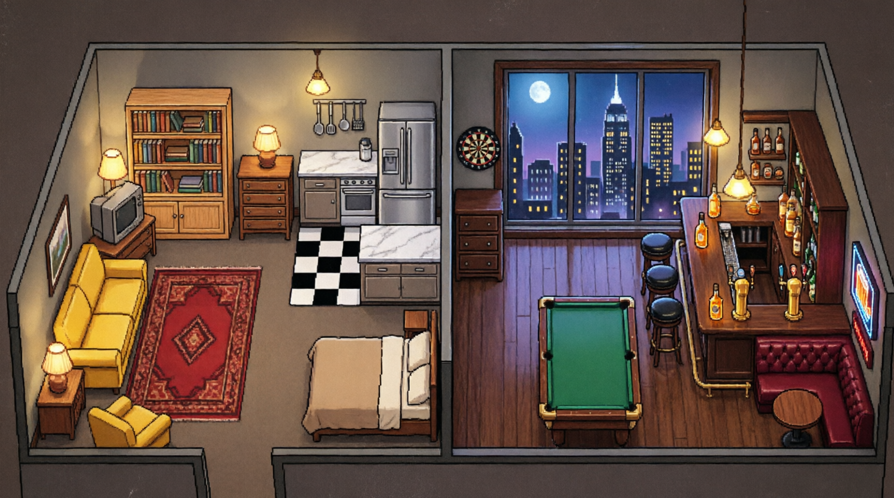

# HIMYM Pixel Floor

A lightweight, multi-agent HIMYM simulation harness optimized for 4GB VRAM.

## Hero Art

## Cast
| Character | Persona |
| :--- | :--- |
| **Ted** | Romantic architect, pretentious about design, talks about destiny. |
| **Barney** | Confident, loves suits, legendary experiences, playbook tactics. |
| **Marshall** | Loyal lawyer, kind-hearted, loves his wife, monster enthusiast. |
| **Lily** | Matchmaker, artist, loves wine, friendly manipulation, fierce protector. |
| **Robin** | Independent Canadian news anchor, loves scotch, hates commitment. |

## API Reference
- **Dashboard**: `http://localhost:8000/dashboard.html`
- **Control API**: `POST /api/control`

## Roadmap
- [x] Simulation logic loop
- [x] Pixel floor visualization
- [x] Persistent memory store
- [x] LLM integration (v10.0.0)
- [x] Dashboard UI (v10.0.0)

---
*Built with love for 4GB VRAM rigs.*
