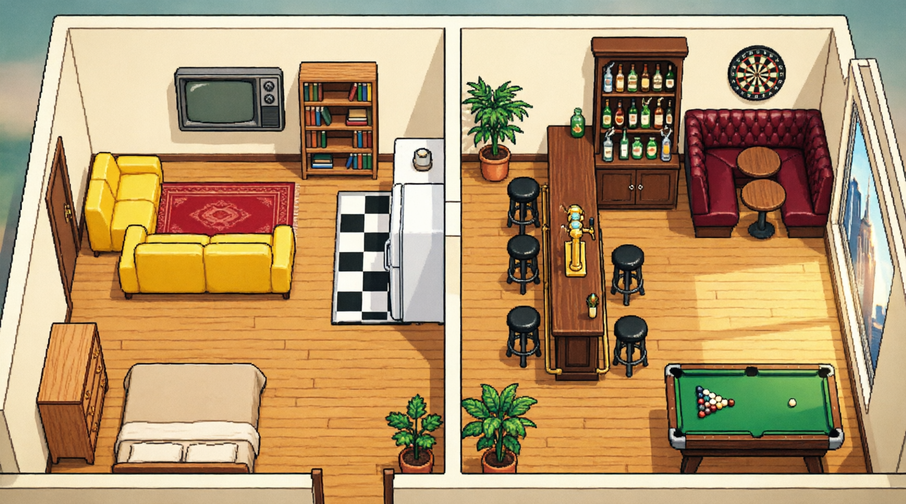

# 🎬 HIMYM Pixel Floor

### A multi-agent harness that runs the gang as your autonomous studio

**Free, open source, and legendary.** Five in-character agents — Ted, Barney,
Marshall, Lily and Robin — coordinate themselves on a living pixel-art floor:
they pick up **real tasks**, draft them, review each other's work, revise,
approve and ship deliverables to your disk… while Future Ted narrates it all.

> **The world's most legendary agents. The world's most sitcom workplace.**


**⬇ [Download the Windows installer](../../releases)** — no Python needed.
Or `python director.py` and you're live in 5 seconds.

---




## Wait, what is this?

HIMYM Pixel Floor wraps five LLM personas in a **hive**: shared memory, a task
pipeline, and a GOD orchestrator (Future Ted). Every agent is an avatar on a
hand-painted day/night floor — they walk between the apartment and MacLaren's,
chat, drink scotch, and **actually work**: every approved task becomes a
markdown deliverable in `himym_data/outputs/`.

- **Every persona is an agent.** In-character writers, reviewers, legal, creative and research — with your LLM or fully offline fallbacks.
- **Every agent is an avatar.** Procedural pixel sprites on AI-painted floors that shift with the sim's day/night cycle.
- **The hive coordinates them.** Queue → draft → review → revise → approve, with a collab graph that thickens as pairs ship work together.
- **Real work ships.** No theater. Approved tasks are saved as files you can open.

## Features

| | |
|---|---|
| **Talk to one narrator, not five** | Future Ted (GOD) assigns, routes and narrates. You brief the floor, not individuals. |
| **Full automation** | Auto-tasks when idle, `.txt` drops into `inbox/`, or the UI queue (`POST /api/task`). |
| **Draft → Review → Revise → Approve** | Marshall reviews contracts, Lily signs off on design, Barney makes it legendary. |
| **Deliverables on disk** | `outputs/task_007_marshall.md` — draft + in-character review, every time. |
| **Day/night pixel art** | Two AI-painted floors (apartment + MacLaren's) swapped by sim time. |
| **Memory that survives** | Markdown-first memory store persists across runs and sessions. |
| **One-click installer** | Inno Setup wizard, per-user install, desktop icon, uninstaller. |
| **Zero telemetry** | Everything runs on your machine. Nothing phones home. Ever. |
| 🎮 Take the wheel | Pause-free human takeover: drive any character, assign work, hand back — every action audited |

## Quick start

**Option A — Installer (Windows):** grab `HIMYM_PixelFloor_Setup_*.exe` from
[Releases](../../releases), run it, done.

**Option B — From source:**
```bash
git clone https://github.com/satyamkabaap/himym-pixel-floor.git
cd himym-pixel-floor
pip install requests
python director.py        # serves + auto-opens the dashboard
```

**Option C — Build everything yourself:**
```bash
build_installer.bat       # exe + setup.exe in one click
```

## How it works

```
        you ── queue / inbox / auto ──► ┌──────────────┐
                                        │  FUTURE TED  │  GOD · narrator
                                        │  (director)  │  routing · pipeline
                                        └──────┬───────┘
                          assign · review · approve · narrate
        ┌──────────┬──────────┬──────────┼────────────────────┐
        ▼          ▼          ▼          ▼          ▼          ▼
   ┌────────┐ ────────┐ ┌─────────┐ ┌────────┐ ┌────────┐
   │  Ted   │ │ Barney │ │ Marshall│ │  Lily  │ │ Robin  │
   │ writer │ │  hype  │ │  legal  │ │creative│ │research│
   └───┬────┘ └───┬────┘ └───┬─────┘ └───┬────┘ └───┬────┘
       └────────── shared hive: memory · tasks · outputs ──────────┘
```

A shipped deliverable looks like this:

```md
# Task 007: Draft the official slap bet contract

## Draft by marshall
- Clause 1: be excellent to each other
- Clause 2: sandwiches mandatory
- Risk assessment: low, vibes high

## Review by lily
APPROVE: chef's kiss.
```

## Roadmap

- [ ] Slack / Telegram intake (message the booth, get deliverables back)
- [ ] Parallel workers + task dependencies (kanban v2)
- [ ] Voice narration — Future Ted reads the terminal (TTS)
- [ ] Scripted "episodes" — seasonal arcs (Slapsgiving, the wedding)
- [ ] Custom character plugins (bring your own sitcom)

## Contributing

Start with [`CONTRIBUTING.md`](CONTRIBUTING.md) — good first areas: new
fallback dialogue, new floor props, new events, translations.
**Every PR must show a before and an after.**

## License & love

- Code: **MIT** — see [`LICENSE`](LICENSE).
- Floor art: AI-generated for this project; sprites drawn procedurally.
- Fonts: Pixelify Sans & VT323 (SIL OFL).
- Inspired by [`chaitanyagiri/munder-difflin`](https://github.com/chaitanyagiri/munder-difflin).
   - Governance & coworker-screen concepts: CopilotKit *OpenBot* (MIT).

_An affectionate fan parody. Not affiliated with CBS, 20th Television, or the
creators of How I Met Your Mother._
